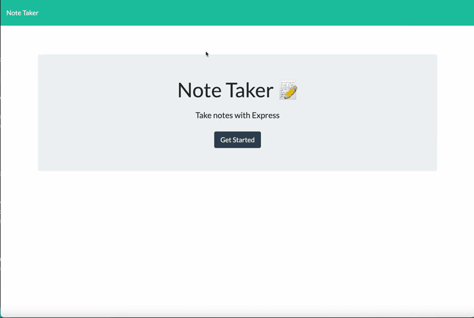

# Note Taker

## Description

This app is a simple note taker built using an Express.js back end, powered by a database written to a JSON file. Users can write, save, and delete notes to help with every day tasks such as grocery lists or to-do lists.

## Table of Contents

- [Installation](#installation)
- [Usage](#usage)
- [Credits](#credits)
- [License](#license)
- [Questions](#questions)

## Installation

The Note Taker app is deployed live on Heroku and can be accessed by clicking https://arcane-escarpment-91966.herokuapp.com/. 

To run the app locally, clone the repository to your local development environment. Run npm install to install all dependencies. To use the application locally, run node server.js, and open http://localhost:3001 in your preferred browser. 

## Usage

A video walk through of the final project is below:

[Video Walkthrough](https://drive.google.com/file/d/1imVZTchuaKzw4KJzxZCjB07BkeS1BSYQ/view?usp=sharing)

## Credits

Coding was completed by Lauren Ferrett, using references from class activities.

## License

MIT License

Copyright (c) 2022 Lauren Ferrett

Permission is hereby granted, free of charge, to any person obtaining a copy
of this software and associated documentation files (the "Software"), to deal
in the Software without restriction, including without limitation the rights
to use, copy, modify, merge, publish, distribute, sublicense, and/or sell
copies of the Software, and to permit persons to whom the Software is
furnished to do so, subject to the following conditions:

The above copyright notice and this permission notice shall be included in all
copies or substantial portions of the Software.

THE SOFTWARE IS PROVIDED "AS IS", WITHOUT WARRANTY OF ANY KIND, EXPRESS OR
IMPLIED, INCLUDING BUT NOT LIMITED TO THE WARRANTIES OF MERCHANTABILITY,
FITNESS FOR A PARTICULAR PURPOSE AND NONINFRINGEMENT. IN NO EVENT SHALL THE
AUTHORS OR COPYRIGHT HOLDERS BE LIABLE FOR ANY CLAIM, DAMAGES OR OTHER
LIABILITY, WHETHER IN AN ACTION OF CONTRACT, TORT OR OTHERWISE, ARISING FROM,
OUT OF OR IN CONNECTION WITH THE SOFTWARE OR THE USE OR OTHER DEALINGS IN THE
SOFTWARE.

## Questions
Any questions can be directed to lferrett@gmail.com
